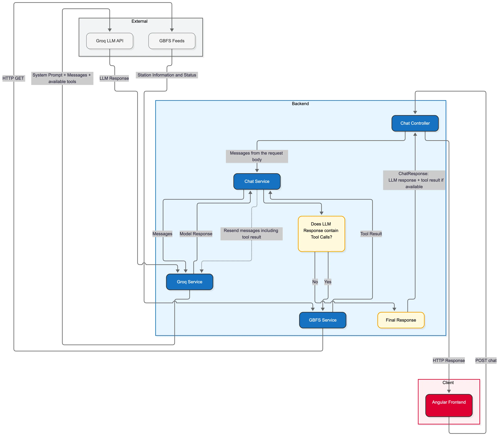
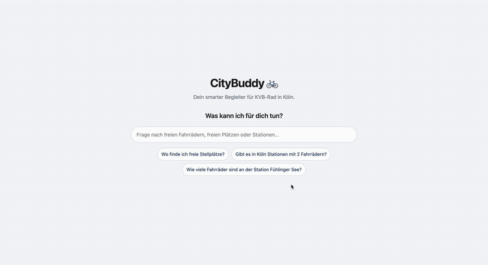
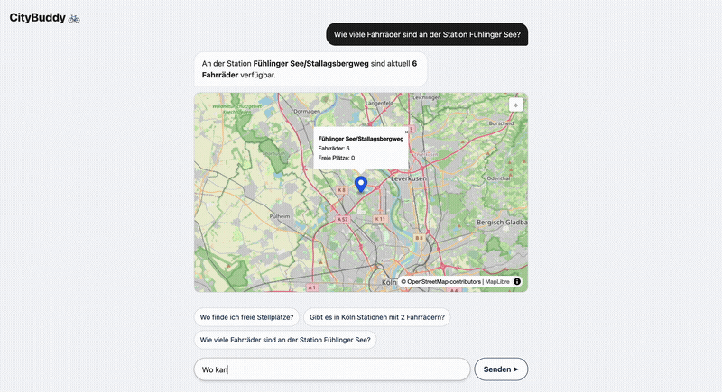

# CityBuddy 🚲

CityBuddy is a full-stack MVP that helps users ask natural-language questions about real-time bike availability in Cologne. Instead of manually checking a station list, users can simply ask things like “Which stations have at least 5 bikes?” or "Which stations have free docks?" and receive a direct answer together with the relevant stations on a map.

The project combines a modern Angular frontend, a NestJS backend, and an LLM-powered tool-calling flow. It fetches live data from the KVB-Rad GBFS feed, filters the stations based on the user’s request, and presents the result in a clean chat interface.

## Features

- Natural-language chat in German
- Real-time KVB-Rad station data from GBFS feeds
- LLM tool calling for retrieving station information
- Search for stations with available bicycles
- Search for stations with free docking spaces
- Search for a specific station
- Interactive MapLibre map
- Station markers with bicycle and docking-space information
- Browser geolocation to show the user's current location
- Markdown rendering for assistant responses
- Loading and error states

## Tech Stack

### Frontend

- Angular
- Tailwind CSS
- TypeScript
- MapLibre GL JS
- ngx-markdown
- OpenStreetMap tiles

### Backend

- NestJS
- TypeScript
- GBFS data integration

### AI Layer

- Groq API
- `openai/gpt-oss-120b`
- Tool calling for structured station queries

## Architecture

<p align="center">
  
</p>

The frontend sends the user conversation to the backend API.

The backend passes the conversation and available tools to the LLM. Depending on the request, the model decides which station query tool to use. The backend then calls the appropriate GBFS-based service, retrieves the current station data, and returns both the structured result and the final AI-generated answer.

The frontend uses that response to render the conversation and highlight the relevant stations directly on the map.

```text
User
  ↓
Angular frontend
  ↓
NestJS REST API
  ↓
Groq LLM
  ↓
Tool call
  ↓
KVB-Rad GBFS feeds
  ↓
Structured station data
  ↓
LLM response + station data
  ↓
Chat + MapLibre map
````

## Available tools

CityBuddy currently provides three tools:

* `getStationsWithBikes` – finds stations with at least the requested number of bicycles
* `getStationsWithFreeDocks` – finds stations with at least the requested number of free docking spaces
* `getStationStatus` – finds stations matching a station name

The tools return structured station data including the station name, available bicycles, free docking spaces and coordinates for map display.

## Getting started

### Requirements

- Node.js 24+
- npm
- Groq API key

### Install dependencies

From the project root:

```bash
npm install
```

### Environment setup

Create the backend environment file:

```bash
cp backend/.env.example backend/.env
```

Then add your Groq key:

```env
GROQ_API_KEY=your_api_key
```

### Run backend

```bash
npm run start:backend
```

### Run frontend

```bash
npm run start:frontend
```

## Demo
<p align="center">
  
  
<p>

This short demo shows the main user flow: the user asks for relevant bike or docking information, the backend calls the appropriate station tool, and the result is displayed directly together with the matching stations on the map.

## Data source

Station information and current station status are retrieved from the KVB-Rad GBFS feeds provided by Nextbike.

The map uses OpenStreetMap tiles rendered with MapLibre GL JS.

## Technical & Architectural Highlights

During the implementation of this MVP, particular attention was paid to robustness, security, and performance:

- **Robust & Defensive Tool Loop (Backend):**  
  The `ChatService` orchestrates the ReAct-style tool-calling loop with strict execution limits (max. 5 rounds and 10 tool-calls per round) to prevent endless execution. LLM tool-call arguments are handled defensively using `try-catch`, with parsing errors fed back into the conversation context so the model can retry with corrected arguments.

- **Performance with `@defer` & Signals (Frontend):**  
  Angular Signals are used for reactive state management. The MapLibre GL map is lazily loaded using Angular's `@defer` control flow once station data is available, reducing the amount of work required during the initial page load.

- **Security & Resource Management (Map):**  
  Map popups are constructed using native DOM methods such as `document.createElement` and `textContent` instead of `innerHTML`, preventing station names from being interpreted as HTML. The MapLibre instance is explicitly destroyed during `OnDestroy` to prevent unnecessary resource usage and potential memory leaks.

## Future improvements

### Functionality
- **Location-based queries:** Allow users to ask for stations near their current location and calculate distances in the backend.
- **District-based queries:** Add geofencing to support queries for specific Cologne districts.
- **Station clustering:** Cluster nearby station markers on the map to improve readability at lower zoom levels.

### Performance & UX
- **Short-TTL caching:** Cache GBFS data for a short period to reduce load on the external API under higher traffic.
- **Text streaming:** Stream LLM responses via SSE for a more responsive chat experience.
- **Mobile & accessibility improvements:** Further improve the responsive layout and accessibility.

### Deployment
- **Deployment setup:** Add a production deployment configuration for frontend and backend.